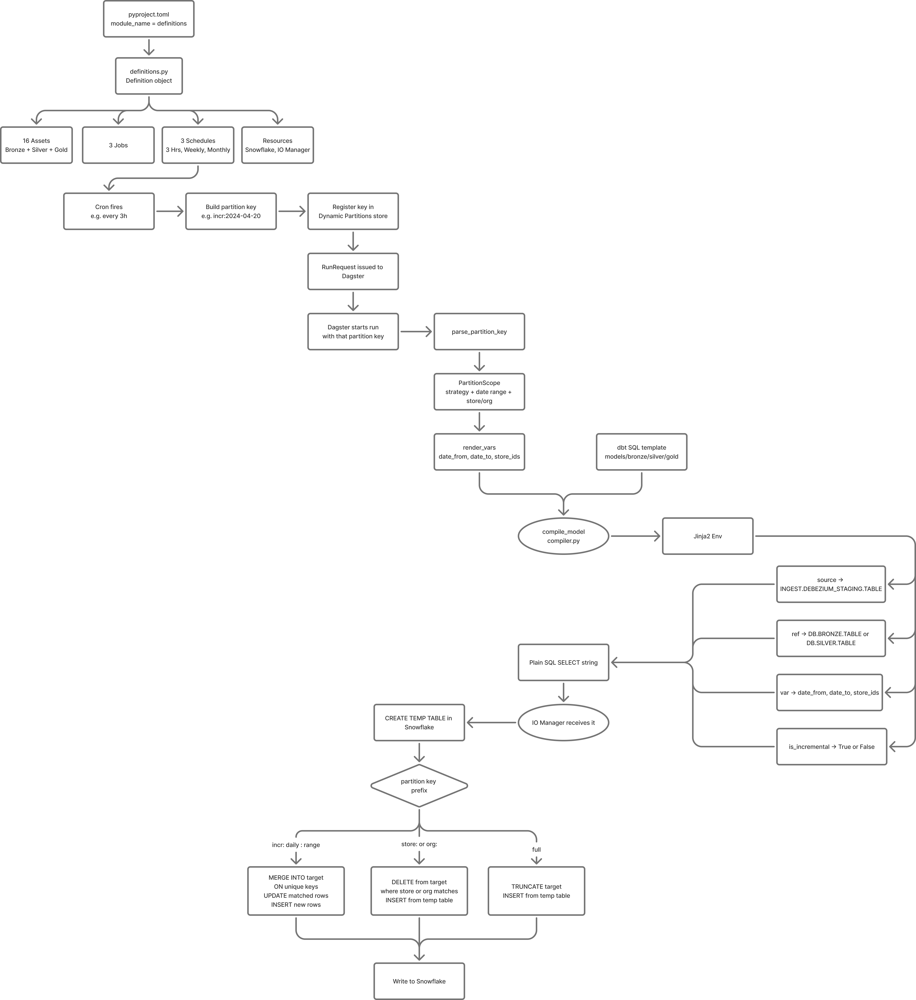

# Partition-Aware Data Warehouse Orchestrator  
### Dagster + Custom SQL Compiler (dbt as Compiler, Not Executor)

---

## Problem

Modern data stacks built on dbt + cloud warehouses (e.g., Snowflake) simplify SQL transformations but introduce critical limitations at scale:

- **Limited control over execution** — dbt tightly couples compilation and execution  
- **High compute cost** — full-model or coarse incremental runs scan more data than necessary  
- **Weak partition-level control** — difficult to surgically reprocess subsets (e.g., single store/org)  
- **Operational rigidity** — limited flexibility in orchestrating custom execution strategies  

In production systems, these issues lead to:
- Increased compute costs  
- Slower pipelines  
- Inefficient reprocessing  
- Reduced control over data freshness  

---

## Solution

This project introduces a **custom warehouse orchestration system** that:

- **Decouples SQL compilation from execution**
- Enables **partition-aware execution strategies**
- Provides **fine-grained reprocessing (store/org level)**
- Optimizes for **cost and performance in Snowflake**

At its core:

> dbt is used purely as a **SQL compiler**, while Dagster + Python fully control execution.

---

## Pipeline Overview



The diagram above shows the full execution flow: a cron fires, a partition key is built and registered, Dagster issues a run, the Python Jinja compiler renders the dbt SQL template into plain executable SQL, the IO Manager receives it, creates a Snowflake temp table, and executes the appropriate write strategy (MERGE / DELETE+INSERT / TRUNCATE+INSERT) based on the partition key prefix.

---

## Core Innovation: dbt as a SQL Compiler

Instead of running `dbt build` or `dbt run`, this system:

1. Uses **dbt for SQL authoring only**  
2. Compiles SQL via a **custom Python Jinja engine**  
3. Executes SQL via a **partition-aware IO Manager**  

This enables:
- Full control over execution  
- Dynamic write strategies  
- Elimination of dbt runtime limitations  

---

## Architecture Overview

- CDC ingestion via Debezium → Snowflake staging  
- Bronze → Silver → Gold layered warehouse  
- Dagster orchestrates execution  
- Python compiler renders SQL  
- Snowflake executes via temp tables  

---

## Execution Flow

1. Schedule triggers partition creation  
2. Dagster launches asset execution  
3. SQL compiled via Python Jinja engine  
4. Temp table created in Snowflake  
5. Partition-specific write strategy applied  

---

## ⚡ Key Capabilities

### Partition-Aware Execution

- `incr:YYYY-MM-DD` → incremental updates  
- `daily:YYYY-MM-DD` → wider refresh window  
- `range:DATE:N` → backfills  
- `store:ID` / `org:ID` → scoped reprocessing  
- `full` → full rebuild  

Enables **surgical recomputation instead of full refresh**

---

### Dynamic Write Strategies

| Strategy | Use Case |
|--------|--------|
| MERGE | Incremental updates |
| DELETE + INSERT | Scoped reprocessing |
| TRUNCATE + INSERT | Full rebuild |

---

## Performance & Impact

This design is inspired by real-world production challenges and similar architectural changes led to:

- **30–40% reduction in compute cost** via partition-level processing
- **~30% reduction in job runtime** (15 min → 10 min)
- Eliminated full refresh dependency using targeted recomputation  
- Enabled **store/org level reprocessing without impacting global pipelines**  

Additional system-level optimizations:
- Reduced unnecessary full-table scans via partition pruning  
- Sliding window merges improved late data handling  
- Temp-table execution avoided redundant computation  

---

## Cost Optimization

- Partition pruning minimizes scanned data  
- Incremental windows balance freshness vs cost  
- Scoped recomputation prevents full rebuilds  
- Temp-table execution reduces repeated query overhead  

---

## Failure Handling & Idempotency

- Idempotent write strategies (MERGE / DELETE+INSERT)  
- Partition-based retries isolate failures  
- Late-arriving CDC handled via sliding windows  
- Backfills supported via `range:` partitions  

---

## Scalability

- Parallel Dagster asset execution  
- Partition-based workload distribution  
- Independent asset lineage tracking  
- Designed for high-volume CDC systems  

---

## Trade-offs

| Trade-off | Impact |
|----------|-------|
| No dbt runtime execution | Requires custom execution engine |
| No dbt test execution | External validation required |
| Manual dependency graph | Increased engineering effort |
| No dbt docs | Reduced built-in metadata tooling |

Trade-offs enable:
- Fine-grained execution control  
- Lower compute cost  
- Flexible orchestration  

---

## Future Improvements

- Integrate data quality frameworks (e.g., Great Expectations)  
- Add query cost monitoring and optimization layer  
- Auto-generate dependency graph from dbt models  
- Introduce observability for freshness & anomaly detection  

---

## Tech Stack

- Dagster (orchestration)  
- Snowflake (warehouse)  
- dbt (SQL authoring only)  
- Python + Jinja (compiler)  
- Debezium (CDC ingestion)  

---

## Why This Matters

This project demonstrates how modern data platforms can move beyond tool limitations by:

- Decoupling compilation from execution  
- Treating orchestration as a first-class system concern  
- Optimizing for cost, scalability, and control  

Shift from:
> “Using tools” → to → **Designing systems**

---

## Summary

A production-inspired system that:

- Reimagines dbt as a compiler  
- Enables partition-aware orchestration  
- Optimizes Snowflake compute usage  
- Supports scalable and precise data operations  

---

## Setup & Usage

### Prerequisites

- Python 3.11+
- Snowflake account with `CREATE TABLE`, `INSERT`, `MERGE`, `DELETE`, `TRUNCATE` on the target database

### Environment

```bash
cp .env.example .env
```

Fill in `.env`:

```dotenv
SNOWFLAKE_ACCOUNT=your-account-id
SNOWFLAKE_USER=your.name@your-company.com
SNOWFLAKE_PASSWORD=
SNOWFLAKE_AUTHENTICATOR=externalbrowser
SNOWFLAKE_ROLE=DATA_ENG
SNOWFLAKE_WAREHOUSE=TRANSFORM_DEV
SNOWFLAKE_DATABASE=YOUR_DATABASE
```

### Install

```bash
python -m venv .venv
source .venv/bin/activate
pip install -r requirements.txt
pip install -e .
```

### Run Dagster UI

```bash
export DAGSTER_HOME=$(pwd)/.tmp/dagster_home
dagster dev -m warehouse_orchestrator.definitions
```

Open [http://localhost:3000](http://localhost:3000).

---

Designed based on real-world data platform challenges in high-scale systems.
